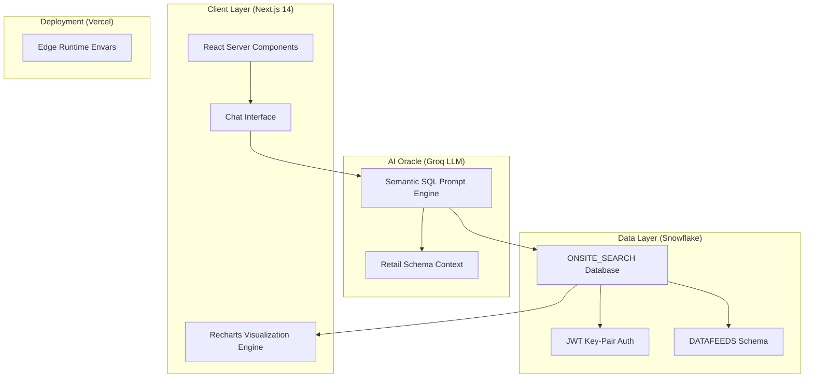

# SnowQuery: Retail Demand Intelligence Dashboard

SnowQuery is a high-performance **Natural Language to Visualization (NL-to-Viz)** platform designed to democratize access to Retail and E-commerce Product Demand datasets (such as Similarweb's Onsite Search data). It leverages **Groq (Llama 3.3 70B)** for semantic-to-SQL translation and **Snowflake's** cloud data warehouse for low-latency analytical queries.

## 🏗️ Technical Architecture

SnowQuery follows a modern serverless architecture with a focus on security and high-fidelity data visualization.



### 🔐 Authentication Flow: JWT Key-Pair
SnowQuery implements extremely secure **JWT-based Key-Pair Authentication** for Snowflake. This approach bypasses traditional password-based login and MFA, making it highly suitable for serverless environments (Vercel) and programmatic API access.

## 📊 Analytical Scope
The platform is indexed against **Retail Demand** and **Onsite Search** datasets, enabling complex business questions like:
- "Show top 10 keywords by search volume"
- "Which sites have the most traffic for 'laptop'?"
- "Compare unique users and total visits by country"
- "What are the trending keywords on amazon.com?"

## 🚀 Tech Stack
- **Framework**: Next.js 14 (App Router)
- **Styling**: Tailwind CSS & Framer Motion (Glassmorphism & Micro-animations)
- **AI Engine**: Groq SDK (Llama 3.3 70B Versatile)
- **Database**: Snowflake (Data Warehouse)
- **Data Visualization**: Recharts (Responsive D3-based engine)

## 🛠️ Installation & Setup

### 1. Prerequisite: Snowflake Key-Pair
Generate your RSA private and public keys. We provide a helper script for this:
```bash
node scripts/generate-keys.js
```
Follow the output instructions to register the public key to your Snowflake user account (`ALTER USER ... SET RSA_PUBLIC_KEY='...'`).

### 2. Environment Configuration
Create a `.env.local` file with the following parameters:
```env
# Snowflake Configuration
SNOWFLAKE_ACCOUNT=your_account_id
SNOWFLAKE_USERNAME=your_username
SNOWFLAKE_DATABASE=ONSITE_SEARCH__PRODUCT_DEMAND_ANALYSIS_ON_RETAIL_SITES_AND_MARKETPLACES
SNOWFLAKE_SCHEMA=DATAFEEDS
SNOWFLAKE_WAREHOUSE=COMPUTE_WH

# AI Configuration
GROQ_API_KEY=your_groq_api_key
```
*(Ensure your `snowflake_rsa_key.p8` file is in the root directory, it will be automatically parsed).*

### 3. Run Locally
```bash
npm install
npm run dev
```

## 🧠 NL-to-SQL Prompt Engineering
The system uses a highly optimized **Instruction-Based Prompt** that is dynamically aware of the session's Snowflake schema. It:
- Maps natural language intent (e.g., "traffic", "demand") to specific columns (e.g., `CALIBRATED_VISITS`).
- Automatically formats the response as a JSON dashboard configuration with up to 4 charts per analysis.
- Generates context-aware follow-up questions to keep the user engaged in their data exploration.

---
*Built for High-Scale Retail Data Intelligence.*
